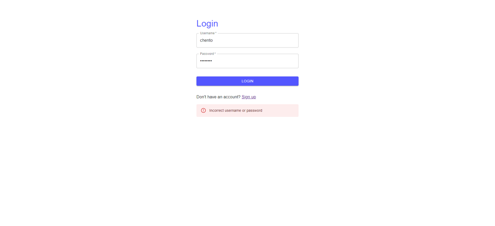
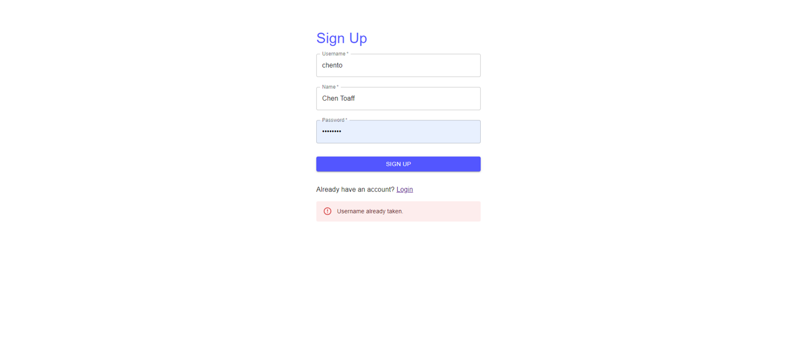
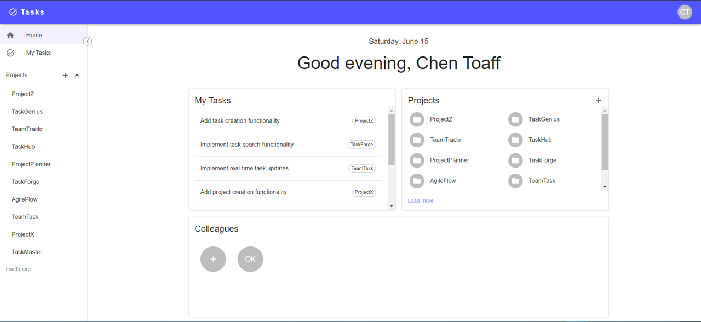
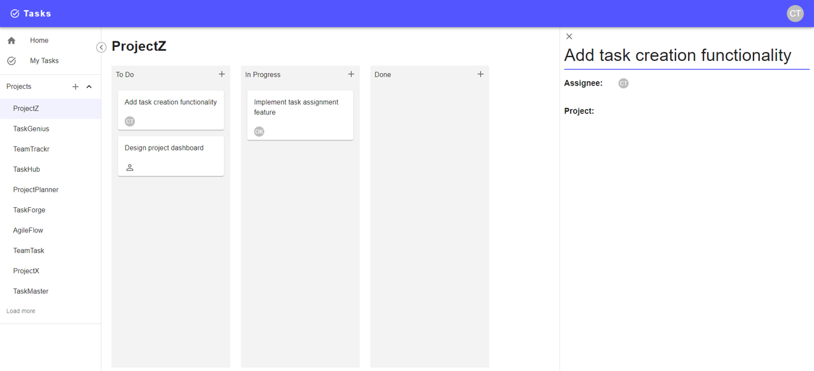

# Tasks

Tasks is a comprehensive full-stack task management web application designed to enhance team collaboration and productivity. The application allows users to create projects, invite colleagues, and manage tasks seamlessly through an intuitive Kanban board interface. With real-time updates powered by WebSocket.io, users experience smooth and immediate synchronization across their tasks and projects.

## Technologies Used

- Frontend: React, Material-UI, TypeScript
- Backend: Node.js, Express, TypeScript, MongoDB, Redis, Passport.js
- Production: NGINX (as a reverse proxy for the backend and frontend)
- Real-time updates: WebSocket.io

## Features

- Create projects and add colleagues
- Kanban board for project task management
- Real-time updates using WebSocket.io
- Task assignment to colleagues
- Task status management (To Do, In Progress, Done)

## Usage

1. Sign up as a user
2. Add colleagues and create projects
3. Manage tasks within projects using the Kanban board
4. Assign tasks to colleagues and update their status

## Future Improvements

- Implement input validations for user inputs
- Backlog of tasks
- More complex user profiles
- Color-coding for projects and users
- Authentication based on refresh tokens
- Task comments and discussion
- Friend requests for adding colleagues

## Running the Project

A Docker Compose file is provided for easy setup.

1. Clone the repository
2. Navigate to the project directory
3. Run `docker-compose up`
4. Access the application at `http://localhost:3000`

For production, NGINX is used as a reverse proxy for the backend and frontend. Make sure to configure NGINX accordingly.

## Screenshots

### Login

### Signup

#### Home

### Project

### Select Assignee

